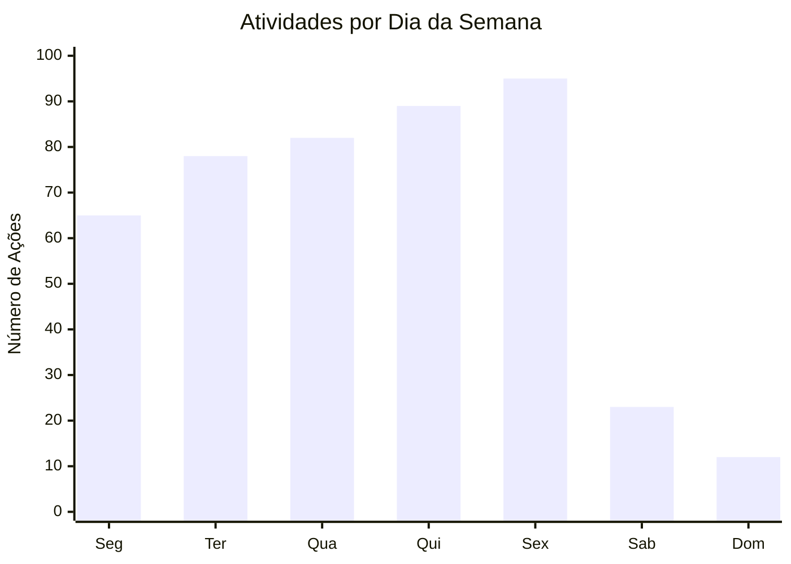
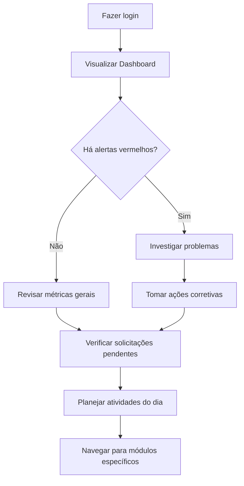

# Dashboard

O Dashboard é sua tela inicial no Nextgoup, oferecendo uma visão consolidada das principais métricas e informações do sistema.

## O que você verá

Ao acessar o Dashboard, a interface é organizada em quatro seções principais:

### 1. Cards de métricas rápidas
**Linha superior com indicadores essenciais:**
- **Usuários Ativos:** Total de contas ativas no sistema
- **Produtos Cadastrados:** Itens no catálogo
- **Solicitações Pendentes:** Aprovações aguardando análise
- **Relatórios do Mês:** Quantos relatórios foram gerados

::: tip Personalização por perfil
Os cards exibidos variam conforme seu perfil:
- **Administrador:** Vê todas as métricas
- **Gestor:** Métricas do seu departamento
- **Operador:** Métricas relacionadas ao seu trabalho
:::

### 2. Gráficos e visualizações

#### Gráfico de atividade (7 dias)
Mostra o volume de atividades por dia da semana

#### Top 5 produtos mais acessados
Lista dos produtos com maior movimentação no período

#### Distribuição por departamento
Gráfico pizza mostrando atividade por área da empresa

### 3. Área de notificações
**Feed em tempo real com:**
- Novas solicitações para aprovação
- Relatórios concluídos
- Alertas do sistema
- Atividades relevantes da equipe

### 4. Ações rápidas
**Botões de acesso direto para tarefas frequentes:**
- [Criar novo usuário](/tasks/criar-usuario)
- [Gerar relatório](/tasks/gerar-relatorio)  
- [Ver solicitações pendentes](/tasks/aprovar-solicitacao)
- Exportar dados do dashboard

## Filtros e personalização

### Período de análise
- **Hoje:** Dados em tempo real
- **Esta semana:** Últimos 7 dias
- **Este mês:** Mês atual
- **Personalizado:** Defina período específico

### Filtros por departamento
Se você é gestor, pode filtrar dados por:
- Sua equipe direta
- Departamento completo
- Todos os departamentos (se permitido)

### Widgets personalizáveis
Clique no ícone ⚙️ para:
- **Reorganizar cards** arrastando e soltando
- **Ocultar métricas** não relevantes
- **Adicionar novos widgets** da biblioteca
- **Definir cores** e temas dos gráficos

::: warning Salvamento automático
Alterações no layout são salvas automaticamente no seu perfil. Para voltar ao padrão, use "Restaurar Layout Original" nas configurações.
:::

## Interpretando as informações

### Cores dos indicadores
- 🟢 **Verde:** Meta atingida, tendência positiva
- 🟡 **Amarelo:** Atenção necessária, próximo ao limite
- 🔴 **Vermelho:** Problema identificado, ação necessária

### Comparação com períodos anteriores  
Setas ao lado dos números indicam:
- ↗️ **Subindo:** Crescimento em relação ao período anterior
- ↘️ **Descendo:** Queda em relação ao período anterior  
- ➡️ **Estável:** Variação mínima (menos de 5%)

### Drill-down nos dados
- **Clique nos cards** para ver detalhes completos
- **Hover sobre gráficos** para valores exatos
- **Clique em barras/fatias** para filtrar automaticamente

## Ações rápidas disponíveis

### Exportar dashboard
1. Clique no botão **"Exportar"**
2. Escolha formato: PDF (visual) ou Excel (dados)
3. Defina período e filtros
4. Baixe o arquivo gerado

### Compartilhar insights
1. Clique em **"Compartilhar"**
2. Adicione destinatários da sua organização
3. Escreva comentário contextual
4. Envie por e-mail automaticamente

### Criar alertas
1. Clique no ícone 🔔 em qualquer métrica
2. Defina condição (maior que, menor que, etc.)
3. Escolha frequência de verificação
4. Configure como deseja ser notificado

## Fluxo típico de uso matinal

## Casos de uso por perfil

### Administrador
- **Foco:** Saúde geral do sistema, usuários, segurança
- **Métricas importantes:** Tentativas de login falhadas, usuários inativos, uso de recursos
- **Ações frequentes:** Criar usuários, revisar logs, ajustar configurações

### Gestor 
- **Foco:** Performance da equipe, aprovações, resultados
- **Métricas importantes:** Produtividade departamental, solicitações em atraso
- **Ações frequentes:** Aprovar solicitações, gerar relatórios departamentais

### Operador
- **Foco:** Suas tarefas pessoais, dados do seu trabalho
- **Métricas importantes:** Atividades próprias, relatórios acessados
- **Ações frequentes:** Gerar relatórios, consultar dados

## Dicas de produtividade

### Rotina matinal recomendada
1. **2 min:** Verificar alertas críticos
2. **3 min:** Revisar solicitações pendentes
3. **5 min:** Analisar métricas da sua área
4. **5 min:** Planejar prioridades do dia

### Configuração para eficiência
- **Pin no navegador** para acesso rápido
- **Configure notificações** para alertas importantes
- **Use filtros salvos** para análises recorrentes
- **Agende relatórios** para receber automaticamente

::: tip Dashboard mobile
O Dashboard é totalmente responsivo. No celular:
- Cards ficam em coluna única
- Gráficos se adaptam ao tamanho da tela  
- Gestos de pinça funcionam para zoom
- Menu lateral vira drawer
:::

## Solução de problemas

### "Dashboard não carrega"
**Possíveis causas:**
- Conexão lenta
- Muitos dados para processar
- Problema temporário do servidor

**Soluções:**
- Reduza o período analisado
- Limpe cache do navegador
- Tente em rede mais rápida

### "Dados desatualizados"
**Causa:** Cache do navegador ou refresh programado
**Solução:** Use Ctrl+F5 para forçar atualização

### "Gráficos não aparecem"
**Causa:** JavaScript bloqueado ou extensão do navegador
**Solução:** Habilite JavaScript ou desative ad-blockers

## Próximos passos

Após revisar o Dashboard:
- **[Acesse módulos específicos](/features/produtos)** para ações detalhadas
- **[Gere relatórios](/tasks/gerar-relatorio)** para análises profundas  
- **[Configure alertas personalizados](/)** para monitoramento proativo

**Dúvidas?** Consulte [FAQ sobre Dashboard](/faq/#dashboard-e-metricas).
