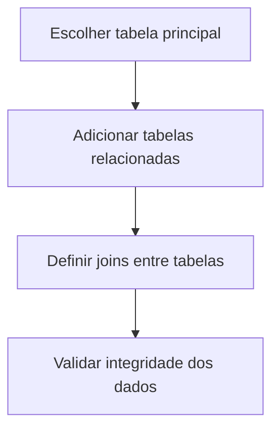

# Módulo Relatórios

O módulo Relatórios é o centro de business intelligence do Nextgoup, oferecendo análises profundas e insights estratégicos sobre todos os aspectos do seu negócio.

## Visão geral

### O que você encontrará
- **30+ relatórios pré-configurados** cobrindo todas as áreas
- **Relatório builder** para criações personalizadas  
- **Dashboards interativos** com drill-down
- **Agendamento automático** e distribuição por e-mail
- **Exportação** em múltiplos formatos
- **Histórico versionado** de todas as análises

### Principais categorias

| Categoria | Relatórios Inclusos | Ideal Para |
|-----------|--------------------|-----------| 
| **Vendas** | Performance, tendências, conversão | Gestores comerciais |
| **Financeiro** | Faturamento, margem, fluxo de caixa | Controllers, diretoria |
| **Operacional** | Produtividade, processos, qualidade | Supervisores |
| **Estratégico** | Market share, competitividade | C-Level, planejamento |

## Navegação principal

### Dashboard de relatórios
**Sua central de comando analítico:**
- **Favoritos:** Relatórios mais usados por você
- **Recentes:** Últimas análises acessadas
- **Agendados:** Relatórios automáticos configurados
- **Compartilhados:** Relatórios recebidos da equipe

### Biblioteca de relatórios
**Catálogo completo organizado por:**
- **Departamento:** Vendas, Marketing, Financeiro, RH
- **Frequência:** Diários, semanais, mensais, anuais
- **Complexidade:** Básico, intermediário, avançado
- **Tipo de dado:** Transacional, agregado, comparativo

### Construtor personalizado
**Ferramenta drag-and-drop para criar relatórios:**
- **Fontes de dados:** Múltiplas tabelas e APIs
- **Campos disponíveis:** Dimensões e métricas
- **Filtros avançados:** Condições complexas
- **Visualizações:** 15+ tipos de gráficos

## Relatórios essenciais

### 📊 Dashboard Executivo
**Visão consolidada do negócio:**
- KPIs principais em tempo real
- Comparativos com metas e período anterior
- Alertas visuais para desvios significativos
- Drill-down para análises detalhadas

**Métricas incluídas:**
- Faturamento (diário, mensal, anual)
- Margem de contribuição
- Número de transações
- Ticket médio
- Taxa de conversão

### 📈 Performance de Vendas
**Análise completa do departamento comercial:**
- Vendas por vendedor, produto, região, canal
- Funil de conversão detalhado
- Pipeline de oportunidades
- Previsão de fechamento

**Segmentações disponíveis:**
- Por período (hora, dia, semana, mês)
- Por vendedor individual ou equipe
- Por categoria de produto
- Por canal de venda
- Por região geográfica

### 💰 Análise Financeira
**Saúde financeira do negócio:**
- Demonstrativo de resultados
- Fluxo de caixa projetado
- Análise de margem por produto/serviço
- Contas a receber e pagar
- Indicadores de liquidez

### 🎯 Análise de Produtos
**Performance do catálogo:**
- Top produtos por faturamento/quantidade
- Análise ABC (curva de Pareto)
- Giro de estoque e ponto de reposição
- Produtos com baixa performance
- Oportunidades de cross-sell/up-sell

## Construtor de relatórios personalizados

### Passo 1: Definir fonte de dados

### Passo 2: Selecionar campos
**Dimensões (o que analisar):**
- Data, período
- Produto, categoria
- Cliente, segmento
- Vendedor, região
- Canal, campanha

**Métricas (o que medir):**
- Quantidade, valor
- Média, mediana
- Percentuais, taxas
- Crescimento, variação
- Índices customizados

### Passo 3: Aplicar filtros
**Filtros temporais:**
- Período específico
- Últimos N dias/meses
- Comparação year-over-year
- Filtros dinâmicos (sempre "este mês")

**Filtros de negócio:**
- Produtos ativos/descontinuados
- Clientes por segmento
- Vendedores por região
- Transações acima de X valor

### Passo 4: Escolher visualização
**Gráficos disponíveis:**
- Coluna/barra (comparações)
- Linha (tendências temporais)
- Pizza/donut (proporções)
- Scatter (correlações)
- Heatmap (distribuições)
- Gauge (metas vs. realizado)

## Agendamento e automação

### Configurar distribuição automática
1. **Frequência:** Diária, semanal, mensal, trimestral
2. **Destinatários:** Lista interna + e-mails externos
3. **Formato:** PDF executivo ou Excel para análise
4. **Condições:** Enviar apenas se dados relevantes
5. **Personalização:** Mensagem customizada

### Alertas inteligentes
**Configure notificações para:**
- Vendas abaixo da meta (% configurável)
- Margem de produtos crítica
- Estoque baixo de itens importantes
- Anomalias nos padrões de venda
- Oportunidades de negócio identificadas

::: tip Automação inteligente
Use "Smart Alerts" que aprendem com seu comportamento:
- Identifica padrões nos seus acessos
- Sugere novos relatórios baseados no seu perfil
- Detecta anomalias automaticamente
- Envia insights proativos por e-mail
:::

## Exportação e compartilhamento

### Formatos de exportação
**PDF Executivo:**
- Layout profissional para apresentações
- Gráficos em alta definição
- Resumo executivo automático
- Branding personalizado da empresa

**Excel Analítico:**
- Dados brutos para análise avançada
- Múltiplas abas organizadas
- Tabelas dinâmicas pré-configuradas
- Gráficos editáveis

**PowerBI/Tableau:**
- Conectores diretos para ferramentas BI
- Refresh automático dos dados
- Dashboards interativos
- Publicação em portais corporativos

### Compartilhamento colaborativo
**Opções disponíveis:**
- **Link público:** Para stakeholders externos
- **Embeds:** Incorporar em sites/intranets
- **Slack/Teams:** Notificações automáticas
- **E-mail:** Distribuição em listas

## Casos de uso por perfil

### CEO/Diretoria
**Relatórios essenciais:**
- Dashboard executivo (mensal)
- Análise de rentabilidade (trimestral)
- Comparativo com concorrência
- Projeções e cenários
- ROI de investimentos

**Frequência recomendada:** Semanal + alertas críticos

### Gerente Comercial
**Relatórios essenciais:**
- Performance individual dos vendedores
- Pipeline de oportunidades
- Análise de conversão por canal
- Produtos com maior margem
- Clientes inativos para reativação

**Frequência recomendada:** Diário

### Controller/Financeiro
**Relatórios essenciais:**
- Fluxo de caixa projetado
- Análise de margem detalhada
- Contas a receber em atraso
- Custos por centro de resultado
- Indicadores financeiros (DRE)

**Frequência recomendada:** Diário + fechamentos mensais

### Analista/Coordenador
**Relatórios essenciais:**
- Análises ad-hoc por demanda
- Relatórios customizados por projeto
- Validação de dados para gestores
- Suporte à tomada de decisão
- KPIs operacionais

**Frequência recomendada:** Conforme demanda

## Melhores práticas

### Design de relatórios eficazes
- **Título claro** indicando propósito
- **Período analisado** sempre visível
- **Insights principais** em destaque
- **Cores consistentes** com padrões visuais
- **Fontes legíveis** mesmo em impressão

### Governança de dados
- **Definições padronizadas** de métricas
- **Glossário de termos** técnicos/comerciais
- **Responsáveis** por cada fonte de dados
- **Calendário** de atualizações críticas
- **Backup** de relatórios estratégicos

### Performance otimizada
- **Índices** em tabelas grandes
- **Agregações pré-calculadas** para relatórios frequentes
- **Cache inteligente** para consultas repetidas
- **Limpeza periódica** de dados históricos desnecessários

::: warning Limite de recursos
Para relatórios muito complexos:
- Execute em horários de baixa demanda
- Use amostragem estatística quando apropriado
- Considere pré-agregações para dados históricos
- Monitore tempo de execução e otimize queries
:::

## Solução de problemas

### "Relatório não carrega"
**Causas comuns:**
- Filtros muito restritivos (nenhum resultado)
- Query muito complexa (timeout)
- Problema de conectividade com base de dados
- Permissões insuficientes para dados solicitados

**Soluções:**
- Simplifique filtros temporariamente
- Execute em horário de menor uso
- Verifique status da conexão
- Contate administrador sobre permissões

### "Dados inconsistentes"
**Causas comuns:**
- Diferenças de timezone entre sistemas
- Dados não sincronizados em tempo real
- Critérios de filtro mal definidos
- Cache desatualizado

**Soluções:**
- Padronize fuso horário nos filtros
- Force refresh da base de dados
- Revise lógica de filtros complexos
- Limpe cache do navegador

## Próximos passos

Para maximizar valor dos relatórios:
1. **[Configure dashboards personalizados](/)** para sua função
2. **[Automatize relatórios recorrentes](/tasks/gerar-relatorio)**  
3. **[Integre com ferramentas de BI](/)**
4. **[Treine equipe](/)** em análise de dados

**Dúvidas avançadas?** Consulte [FAQ sobre Relatórios](/faq/#relatorios-e-exportacao).
