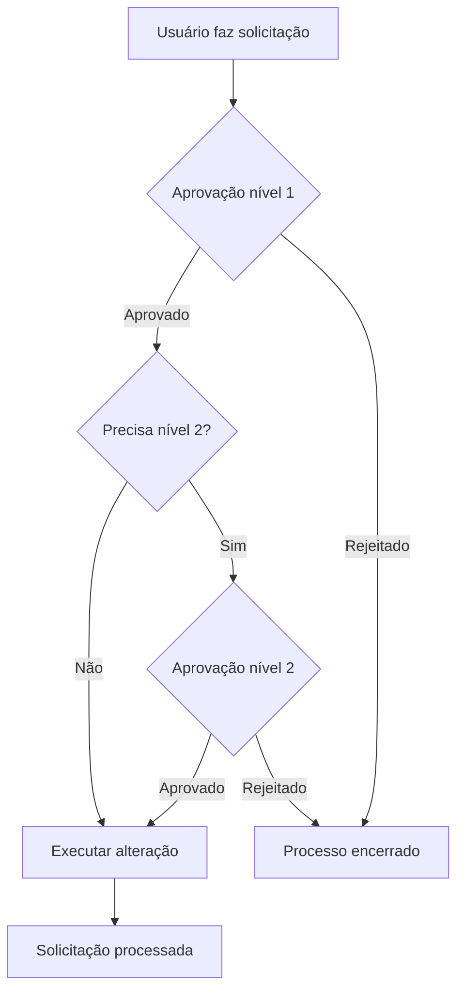

# Aprovar Solicitação

Guia completo para revisar e aprovar solicitações no sistema Nextgoup.

## Quem pode executar esta tarefa?
- ✅ **Administrador:** Todas as solicitações
- ✅ **Gestor:** Solicitações do seu departamento
- ❌ **Operador:** Sem permissão de aprovação

**Tempo médio de execução:** 2-5 minutos por solicitação

## Passo a passo

### 1. Acessar solicitações pendentes
1. No menu lateral, clique em **"Solicitações"**
2. Por padrão, você verá a aba **"Pendentes"**
3. Use filtros se necessário (departamento, tipo, prioridade)

### 2. Revisar detalhes da solicitação
Clique na solicitação para ver:

**Informações do solicitante:**
- Nome e e-mail
- Departamento e cargo
- Data/hora da solicitação

**Detalhes da solicitação:**
- Tipo (alteração de dados, novo acesso, etc.)
- Descrição detalhada
- Justificativa
- Documentos anexados (se houver)

**Histórico:**
- Alterações anteriores
- Comentários de outros aprovadores
- Status anterior

::: tip Análise criteriosa
Antes de aprovar, considere:
- A solicitação está bem justificada?
- O usuário tem necessidade real?  
- Há impacto de segurança ou compliance?
- Todos os documentos necessários foram anexados?
:::

### 3. Tomar decisão

#### Opção A: Aprovar
1. Clique em **"Aprovar"**
2. Adicione comentários se necessário
3. Selecione data de vigência (se aplicável)
4. Confirme a aprovação

#### Opção B: Rejeitar  
1. Clique em **"Rejeitar"**
2. **Obrigatório:** Adicione motivo da rejeição
3. Sugira correções se possível
4. Confirme a rejeição

#### Opção C: Solicitar mais informações
1. Clique em **"Solicitar Esclarecimentos"**
2. Descreva quais informações faltam
3. Defina prazo para resposta
4. Solicitation volta para status "Aguardando Informações"

### 4. Confirmar ação
- Revise sua decisão na tela de confirmação
- Verifique se comentários estão claros
- Clique em **"Confirmar"**

## Estados das solicitações

| Status | Descrição | Ação Necessária |
|--------|-----------|-----------------|
| **Pendente** | Aguardando primeira análise | Aprovar/Rejeitar |
| **Em Análise** | Sendo revisada por aprovador | Aguardar decisão |
| **Aguardando Info** | Precisa esclarecimentos | Usuário deve responder |
| **Aprovada** | Aceita pelo aprovador | Sistema executa automaticamente |
| **Rejeitada** | Negada pelo aprovador | Processo encerrado |
| **Processada** | Aprovação executada no sistema | Concluída |

## Tipos comuns de solicitação

### Alteração de dados pessoais
**O que analisar:**
- Documentos comprobatórios anexados
- Dados coerentes com registros anteriores
- Motivo da alteração

**Tempo de processamento:** Imediato após aprovação

### Solicitação de acesso adicional
**O que analisar:**
- Justificativa de necessidade de negócio
- Aprovação do gestor imediato
- Compatibilidade com cargo atual

**Tempo de processamento:** Até 24h após aprovação

### Alteração de permissões
**O que analisar:**
- Autorização do responsável pelo sistema
- Impacto de segurança
- Necessidade temporária vs. permanente

**Tempo de processamento:** Imediato após aprovação

::: warning Cuidados especiais
**Solicitações que exigem atenção extra:**
- Aumento de privilégios de acesso
- Alterações em dados financeiros
- Solicitações fora do horário comercial
- Usuários com histórico de violações
:::

## Fluxo de aprovação em múltiplos níveis

### Aprovação dupla obrigatória
Alguns tipos exigem dois aprovadores:
- Alterações financeiras > R$ 1.000
- Criação de usuários administradores
- Mudanças em políticas de segurança
- Acessos a dados sensíveis

## Notificações e prazos

### Notificações automáticas
Você será notificado por:
- **E-mail:** Para novas solicitações
- **Sistema:** Badge no menu lateral
- **Push:** Se configurado no mobile

### Prazos para aprovação
- **Urgente:** 4 horas úteis
- **Alta prioridade:** 24 horas
- **Normal:** 72 horas  
- **Baixa prioridade:** 1 semana

::: warning SLA de aprovação
Solicitações não analisadas no prazo são:
- Escaladas para seu gestor
- Marcadas como "Atrasadas" no sistema
- Incluídas em relatórios de performance
:::

## Auditoria e histórico

### Rastreabilidade
Todas as aprovações ficam registradas:
- **Quem:** Aprovador responsável
- **Quando:** Data e hora exata
- **O que:** Detalhes da decisão
- **Por que:** Comentários adicionados

### Relatórios de auditoria
Administradores podem gerar relatórios com:
- Tempo médio de aprovação por usuário
- Taxa de aprovação vs. rejeição
- Solicitações em atraso
- Histórico de decisões questionáveis

## Erros comuns e soluções

### "Não posso ver solicitações"
**Causa:** Permissões insuficientes
**Solução:** Verifique se seu perfil permite aprovações

### "Solicitação não carrega"
**Causa:** Problema técnico temporário
**Solução:** Atualize página ou tente mais tarde

### "Aprovação não salva"
**Causa:** Sessão expirada ou campos obrigatórios vazios
**Solução:** Faça login novamente e preencha todos os campos

::: tip Boas práticas
- **Seja rápido:** Não deixe solicitações acumularem
- **Seja claro:** Comentários ajudam o solicitante
- **Seja criterioso:** Sua aprovação tem impacto no negócio
- **Documente:** Registre sempre o motivo da decisão
:::

## Próximos passos

Após aprovar/rejeitar:
1. **Monitore execução** das solicitações aprovadas
2. **Acompanhe feedback** dos solicitantes
3. **Revise processos** se houver recorrência de problemas
4. **Reporte issues** sistêmicos para TI

**Dúvidas?** Consulte [FAQ sobre Aprovações](/faq/#aprovacoes-e-solicitacoes).
