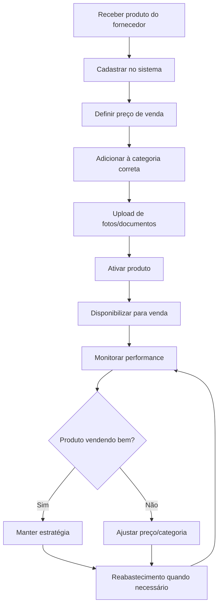

# Módulo Produtos

O módulo Produtos é o centro de gestão do catálogo da sua empresa, permitindo cadastro, edição, organização e análise de todos os itens comercializados.

## O que você pode fazer

### Gestão básica
- **Cadastrar novos produtos** com informações completas
- **Editar dados existentes** (preços, descrições, especificações)
- **Organizar por categorias** e subcategorias
- **Controlar status** (ativo, inativo, descontinuado)

### Controle de estoque
- **Monitorar quantidades** disponíveis
- **Definir níveis críticos** para alertas automáticos
- **Registrar movimentações** de entrada e saída
- **Acompanhar histórico** de variações

### Análises e relatórios
- **Produtos mais vendidos** em período específico
- **Análise ABC** (classificação por importância)
- **Margem de lucro** por produto ou categoria
- **Giro de estoque** e tempo médio de venda

## Navegação principal

### Aba "Lista de Produtos"
**Visão geral de todos os produtos cadastrados:**
- Tabela com colunas customizáveis
- Busca rápida por nome ou código
- Filtros por categoria, status, preço
- Ordenação por qualquer campo
- Ações em lote (ativar, desativar, exportar)

### Aba "Categorias"
**Organização do catálogo:**
- Hierarquia de categorias e subcategorias
- Drag & drop para reordenação
- Criação de novas classificações
- Produtos órfãos (sem categoria definida)

### Aba "Estoque"
**Controle de quantidades:**
- Níveis atuais de estoque
- Produtos em falta (quantidade zero)
- Alertas de estoque mínimo
- Histórico de movimentações

### Aba "Relatórios"
**Análises específicas do módulo:**
- Performance por produto
- Análise de rentabilidade
- Comparativos de períodos
- Exportação em diversos formatos

## Cadastro de produto

### Informações básicas
**Campos obrigatórios:**
- **Nome do produto:** Título comercial
- **Código/SKU:** Identificador único
- **Categoria:** Classificação principal
- **Preço de venda:** Valor final ao cliente
- **Status:** Ativo, Inativo, Descontinuado

**Campos opcionais:**
- **Descrição detalhada:** Especificações técnicas
- **Preço de custo:** Para cálculo de margem
- **Peso/dimensões:** Para cálculo de frete
- **Fornecedor:** Origem do produto
- **Observações internas:** Notas para equipe

### Imagens e mídia
- **Foto principal:** Imagem de destaque
- **Galeria:** Até 10 imagens adicionais
- **Documentos:** Manuais, certificados, fichas técnicas
- **Vídeos:** Links do YouTube ou Vimeo

::: tip Qualidade das imagens
Para melhor apresentação:
- Use imagens em alta resolução (mín. 800x600px)
- Fundo branco ou transparente
- Formato JPG, PNG ou WebP
- Tamanho máximo 2MB por imagem
:::

### Controle de estoque
- **Estoque atual:** Quantidade disponível
- **Estoque mínimo:** Nível para alerta
- **Estoque máximo:** Limite para compras
- **Localização:** Onde está armazenado
- **Unidade de medida:** Peça, kg, metro, litro

## Organizando seu catálogo

### Estrutura de categorias recomendada
```
Eletrônicos
├── Smartphones
│   ├── Android
│   └── iPhone
├── Computadores
│   ├── Desktop
│   ├── Notebook
│   └── Tablets
└── Acessórios
    ├── Capas e Cases
    └── Carregadores
```

### Nomenclatura padronizada
**Boas práticas para nomes:**
- Use padrão consistente: "Marca + Modelo + Variação"
- Evite abreviações confusas
- Inclua informações-chave no título
- Exemplo: "iPhone 14 Pro 256GB Azul"

### Códigos/SKUs organizados
**Sugestão de estrutura:**
- **Categoria (2 digitos) + Sequencial (4 dígitos)**
- EL0001 = Eletrônicos, produto 0001
- RO0045 = Roupas, produto 0045
- Facilita busca e organização

## Fluxo de trabalho típico



## Ações rápidas disponíveis

### Importação em lote
1. **Baixe template Excel** disponível no sistema
2. **Preencha planilha** com dados dos produtos
3. **Valide informações** antes do upload
4. **Importe arquivo** e aguarde processamento
5. **Revise relatório** de importação (erros/sucessos)

### Exportação de dados
**Formatos disponíveis:**
- **Excel completo:** Todos os campos e fotos
- **CSV para e-commerce:** Formato para lojas online
- **PDF catálogo:** Visual para impressão
- **JSON API:** Para integrações técnicas

### Operações em lote
Selecione múltiplos produtos para:
- **Alterar categoria** simultaneamente
- **Ajustar preços** com percentual ou valor fixo
- **Ativar/desativar** grupos de produtos
- **Exportar selection** específica

## Relatórios específicos

### Top produtos (mais vendidos)
- Ranking por quantidade ou valor
- Filtro por período customizável
- Comparação com período anterior
- Identificação de tendências

### Análise ABC
**Classificação por importância financeira:**
- **Classe A:** 20% dos produtos = 80% do faturamento
- **Classe B:** 30% dos produtos = 15% do faturamento  
- **Classe C:** 50% dos produtos = 5% do faturamento

### Margem de lucro
- Rentabilidade por produto
- Comparação preço custo vs. venda
- Identificação de produtos deficitários
- Sugestões de otimização

::: warning Precificação inteligente
Use os relatórios de margem para:
- Identificar produtos com margem muito baixa
- Ajustar preços sazonalmente
- Definir promoções estratégicas
- Negociar melhores condições com fornecedores
:::

## Integrações disponíveis

### E-commerce
- **Sincronização automática** com loja online
- **Atualização de preços** em tempo real
- **Controle de estoque unificado**
- **Importação de pedidos**

### ERP/Financeiro
- **Integração com sistema fiscal**
- **Custos atualizados automaticamente**
- **Relatórios contábeis**
- **Conciliação de vendas**

### Fornecedores
- **Catálogos compartilhados**
- **Atualizações automáticas de preço**
- **Disponibilidade de estoque**
- **Novos lançamentos**

## Dicas para otimizar vendas

### SEO interno
- Use **palavras-chave relevantes** nas descrições
- **Tags de busca** para facilitar encontrar produtos
- **Sinônimos e variações** do nome do produto
- **Características técnicas** bem detalhadas

### Gestão de estoque eficiente
- **Monitore giro** regularmente
- **Ajuste níveis mínimos** sazonalmente  
- **Identifique produtos encalhados** para promoções
- **Preveja demanda** baseada em histórico

## Próximos passos

Após dominar o módulo Produtos:
1. **[Configure relatórios automáticos](/tasks/gerar-relatorio)** 
2. **[Integre com outros módulos](/features/relatorios)**
3. **[Defina alertas de estoque](/)** personalizados
4. **[Treine sua equipe](/)** nas melhores práticas

**Dúvidas?** Consulte [FAQ sobre Produtos](/faq/#produtos-e-catalogo).
