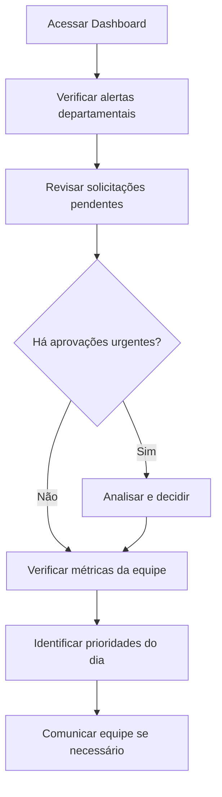

# Perfil Gestor

O Gestor é um usuário intermediário com permissões amplas dentro de seu departamento ou área de responsabilidade, focado em supervisão de equipes e tomada de decisões táticas.

## Características do perfil

### Escopo de atuação
- **Departamental:** Acesso limitado à sua área de responsabilidade
- **Hierárquico:** Pode ver dados de subordinados diretos
- **Aprovação:** Autoriza solicitações dentro de sua alçada
- **Relatórios:** Analytics de sua equipe e processos
- **Configuração:** Ajustes específicos de seu departamento

### Usuários típicos
- **Gerentes de departamento**
- **Coordenadores de área**  
- **Supervisores de equipe**
- **Líderes de projeto**
- **Responsáveis por processo**

## Permissões por módulo

### ✅ Dashboard
**Acesso completo com filtros departamentais:**
- Métricas da sua área de responsabilidade
- Comparativo com outras áreas (apenas visão)
- Acompanhamento de metas departamentais
- Alertas relevantes para sua gestão

### ✅ Usuários (Limitado)
**Pode visualizar, não pode criar/editar:**
- Lista de usuários de seu departamento
- Histórico de atividades da equipe
- Relatório de produtividade individual
- Solicitação de criação via administrador

::: tip Gestão de equipe
Embora não possa criar usuários diretamente, o Gestor pode:
- Solicitar criação de novos usuários
- Sugerir alterações de permissões
- Reportar necessidades de treinamento
- Acompanhar performance individual
:::

### ✅ Produtos
**Acesso conforme departamento:**
- **Comercial:** Visualização completa + edição de preços
- **Estoque:** Controle de quantidades + movimentações
- **Marketing:** Descrições e imagens + categorização
- **Financeiro:** Custos e margens + análise de rentabilidade

### ✅ Relatórios
**Biblioteca ampla com foco departamental:**
- Todos os relatórios de sua área
- Comparativos inter-departamentais (apenas leitura)
- Criação de relatórios customizados
- Agendamento e distribuição para equipe
- Exportação sem restrições de volume

### ✅ Solicitações
**Aprovação dentro da hierarquia:**
- Solicitações de subordinados diretos
- Pedidos relacionados ao seu departamento
- Aprovações até limite financeiro definido
- Escalação para superiores quando necessário

### ⚠️ Configurações (Parcial)
**Apenas configurações do seu escopo:**
- Preferências do departamento
- Templates de relatórios da área
- Configurações de workflow próprias
- Personalização de dashboards

## Responsabilidades principais

### 👥 Gestão de equipe
- **Acompanhar produtividade** individual e coletiva
- **Identificar necessidades** de treinamento
- **Avaliar performance** com base em métricas
- **Distribuir tarefas** e responsabilidades
- **Motivar e desenvolver** colaboradores

### 📊 Análise e tomada de decisão
- **Interpretar relatórios** departamentais
- **Identificar tendências** e oportunidades
- **Propor melhorias** em processos
- **Definir metas** para a equipe
- **Acompanhar indicadores** de performance

### ✅ Aprovações e controles
- **Revisar solicitações** da equipe
- **Aprovar despesas** dentro do orçamento
- **Validar alterações** em dados críticos
- **Autorizar acessos** temporários
- **Garantir compliance** com políticas

### 📈 Planejamento tático
- **Elaborar planos** departamentais
- **Alocar recursos** disponíveis
- **Coordenar com outras áreas**
- **Monitorar cronogramas**
- **Reportar à diretoria**

## Fluxo de trabalho típico

### Rotina diária (30-45 min)

### Rotina semanal (2-3 horas)
- **Segunda:** Planejamento da semana baseado em métricas
- **Quarta:** Revisão de meio de semana e ajustes
- **Sexta:** Fechamento semanal e preparação da próxima
- **Relatórios:** Geração e análise de KPIs semanais
- **One-on-ones:** Reuniões individuais com equipe

### Rotina mensal (4-6 horas)
- **Fechamento departamental** completo
- **Análise de tendências** e sazonalidades
- **Planejamento do próximo** período
- **Avaliação de performance** individual
- **Revisão de processos** e melhorias
- **Apresentação para diretoria**

## Casos de uso por departamento

### Gestor Comercial
**Foco:** Vendas, pipeline, performance de vendedores
**Relatórios principais:**
- Performance individual de vendedores
- Conversão por fonte de leads
- Pipeline de oportunidades
- Ticket médio e sazonalidade
- ROI de campanhas

**Aprovações típicas:**
- Descontos acima do padrão
- Alterações em cadastro de clientes
- Acessos a informações confidenciais
- Participação em feiras/eventos

### Gestor Financeiro
**Foco:** Fluxo de caixa, margem, custos, compliance
**Relatórios principais:**
- DRE departamental
- Análise de margem por produto
- Contas a receber em atraso
- Budget vs. Realizado
- Indicadores de liquidez

**Aprovações típicas:**
- Despesas dentro do orçamento
- Alterações em preços/custos
- Liberação de pagamentos
- Reclassificações contábeis

### Gestor de Operações
**Foco:** Produtividade, qualidade, prazos, recursos
**Relatórios principais:**
- Eficiência operacional
- Controle de qualidade
- Utilização de recursos
- Tempo médio de processos
- Indicadores de satisfação

**Aprovações típicas:**
- Horas extras da equipe
- Alterações em processos
- Compra de materiais/equipamentos
- Treinamentos especializados

## Limites e escalação

### Limites financeiros típicos
| Tipo de Solicitação | Limite Gestor | Acima → Escalação |
|---------------------|---------------|-------------------|
| **Despesas operacionais** | R$ 5.000 | Diretoria |
| **Descontos comerciais** | 15% | Diretor Comercial |
| **Horas extras** | 20h/mês por pessoa | RH + Diretoria |
| **Treinamentos** | R$ 2.000/pessoa | Diretoria |
| **Equipamentos** | R$ 3.000 | TI + Financeiro |

### Quando escalar
**Escale para administrador quando:**
- Precisar criar/editar usuários
- Houver problemas técnicos
- Necessitar relatórios inter-departamentais
- Suspeitar de problemas de segurança

**Escale para diretoria quando:**
- Solicitações acima do seu limite
- Decisões estratégicas necessárias
- Conflitos entre departamentos
- Mudanças em políticas

## Ferramentas exclusivas

### Dashboard gerencial
**Widgets específicos para gestores:**
- **Scorecard da equipe** com ranking
- **Alertas de desvio** de metas
- **Pipeline visual** de aprovações
- **Comparativo departamental**
- **Projeções** baseadas em tendências

### Relatórios gerenciais
**Templates pré-configurados:**
- **Relatório de gestão** (semanal/mensal)
- **Performance individual** da equipe
- **Análise comparativa** com períodos anteriores
- **Indicadores de produtividade**
- **ROI de iniciativas** departamentais

### Ferramentas de aprovação
**Interface otimizada:**
- **Aprovação em lote** para múltiplas solicitações
- **Templates de justificativa** para rejeições
- **Histórico de decisões** anteriores
- **Delegação temporária** durante ausências
- **Alertas de prazo** para aprovações

## Desenvolvimento como gestor

### Métricas de sucesso
**Acompanhe seu desempenho:**
- **Tempo médio** de aprovação de solicitações
- **Taxa de satisfação** da equipe
- **Atingimento** de metas departamentais
- **Eficiência** em relatórios gerados
- **Proatividade** em identificar problemas

### Oportunidades de crescimento
- **Certificações** em gestão e liderança
- **Treinamentos** em análise de dados
- **Workshops** de melhoria de processos
- **Participação** em projetos estratégicos
- **Mentoria** de outros gestores

::: tip Melhores práticas
- **Seja transparente** com métricas da equipe
- **Comunique proativamente** mudanças importantes
- **Use dados** para justificar decisões
- **Invista tempo** em desenvolvimento da equipe
- **Mantenha foco** nos objetivos estratégicos
:::

## Próximos passos

Para maximizar sua eficiência como gestor:
1. **[Configure dashboards personalizados](/features/dashboard)** para sua área
2. **[Automatize relatórios](/tasks/gerar-relatorio)** de acompanhamento
3. **[Otimize processos](/tasks/aprovar-solicitacao)** de aprovação
4. **[Desenvolva sua equipe](/)** com base em dados

**Dúvidas específicas?** Consulte [FAQ para Gestores](/faq/#perfil-gestor).
