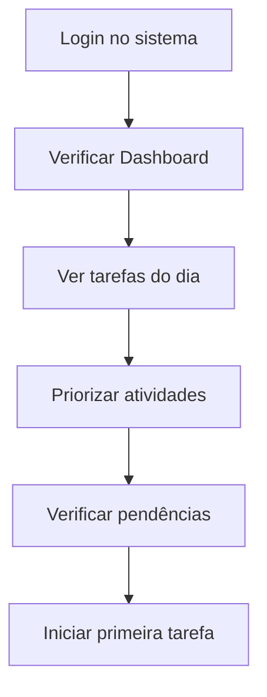
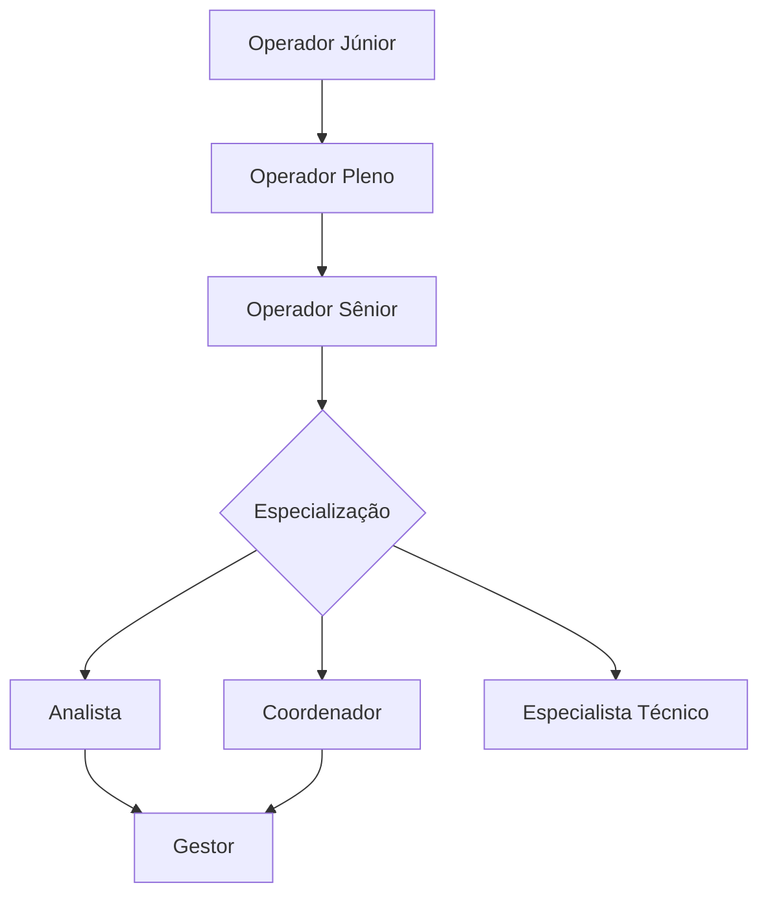

# Perfil Operador

O Operador é o usuário final padrão do sistema, focado em executar tarefas específicas dentro de seu escopo de trabalho, com permissões limitadas mas suficientes para suas atividades diárias.

## Características do perfil

### Filosofia do perfil
- **Simplicidade:** Interface limpa focada em tarefas essenciais
- **Segurança:** Acesso restrito apenas ao necessário
- **Eficiência:** Fluxos otimizados para agilidade operacional
- **Suporte:** Orientação contextual e ajuda integrada

### Usuários típicos
- **Assistentes administrativos**
- **Representantes de vendas**
- **Analistas júnior**
- **Operadores de sistema**
- **Consultores de atendimento**
- **Estagiários e trainee**

## Permissões por módulo

### ✅ Dashboard (Visão própria)
**Métricas relacionadas ao seu trabalho:**
- Suas atividades diárias e semanais
- Metas individuais vs. realizado
- Tarefas pendentes e concluídas
- Estatísticas de produtividade pessoal
- Notificações relevantes

::: tip Dashboard personalizado
O sistema automaticamente adapta o Dashboard baseado em:
- Seu departamento de origem
- Tarefas mais frequentes
- Permissões específicas
- Preferências definidas
:::

### ✅ Consulta de dados
**Visualização sem edição:**
- **Produtos:** Catálogo completo para consulta
- **Clientes:** Base para atendimento/vendas (conforme permissão)
- **Relatórios básicos:** Dados relacionados ao seu trabalho
- **Histórico:** Suas próprias atividades no sistema

### ⚠️ Edição limitada
**Apenas dados relacionados ao seu escopo:**
- **Seus cadastros:** Informações pessoais, preferências
- **Atividades atribuídas:** Tarefas sob sua responsabilidade
- **Dados de trabalho:** Conforme função (ex: vendas, atendimento)

### ❌ Sem acesso
- **Configurações globais** do sistema
- **Dados de outros usuários** (salvo quando necessário para trabalho)
- **Relatórios gerenciais** e estratégicos
- **Aprovações** de solicitações
- **Administração** de qualquer tipo

## Responsabilidades principais

### 📋 Execução de tarefas
- **Seguir procedimentos** estabelecidos
- **Registrar atividades** no sistema
- **Manter dados atualizados** sob sua responsabilidade
- **Cumprir prazos** definidos
- **Reportar problemas** aos superiores

### 📊 Consulta e análise básica
- **Extrair relatórios** de sua área
- **Interpretar dados básicos** para tomada de decisão
- **Identificar inconsistências** em informações
- **Sugerir melhorias** em processos
- **Acompanhar métricas** de performance pessoal

### 🎯 Foco na produtividade
- **Otimizar rotinas** diárias
- **Usar shortcuts** e automações disponíveis
- **Manter organização** dos dados
- **Buscar eficiência** em tarefas repetitivas
- **Colaborar** com a equipe

## Fluxo de trabalho típico

### Início do dia (10-15 min)

### Durante o dia
- **Execução de tarefas** conforme cronograma
- **Registro de atividades** em tempo real
- **Consultas** a dados necessários
- **Comunicação** com supervisores quando necessário
- **Atualização** de status das atividades

### Fim do dia (5-10 min)
- **Finalizar tarefas** em andamento
- **Atualizar status** no sistema
- **Registrar observações** importantes
- **Preparar** agenda do próximo dia
- **Fazer logout** seguro

## Casos de uso por função

### Operador de Vendas
**Atividades principais:**
- Consultar catálogo de produtos
- Registrar pedidos de clientes
- Acompanhar status de vendas
- Gerar cotações básicas
- Atualizar dados de clientes

**Relatórios acessíveis:**
- Suas vendas (diário/semanal/mensal)
- Pipeline pessoal de oportunidades
- Performance vs. meta individual
- Histórico de clientes atendidos

### Operador Administrativo
**Atividades principais:**
- Lançar dados em formulários
- Organizar documentos digitais
- Fazer consultas para atendimento
- Executar rotinas de processo
- Manter cadastros atualizados

**Relatórios acessíveis:**
- Relatórios de atividades próprias
- Status de processos sob responsabilidade
- Indicadores de produtividade pessoal
- Histórico de tarefas executadas

### Operador de Atendimento
**Atividades principais:**
- Consultar base de clientes
- Registrar interações/ocorrências
- Abrir chamados/solicitações
- Acompanhar resolução de problemas
- Atualizar informações de contato

**Relatórios acessíveis:**
- Tickets atendidos
- Tempo médio de atendimento
- Avaliações de satisfação
- Histórico de interações

## Interface otimizada

### Elementos visuais simplificados
- **Menu enxuto** com apenas opções relevantes
- **Dashcards grandes** para visualização rápida
- **Botões de ação** claramente identificados
- **Navegação intuitiva** entre telas
- **Ajuda contextual** sempre disponível

### Workflows guiados
- **Assistentes step-by-step** para tarefas complexas
- **Validações em tempo real** para evitar erros
- **Auto-complete** em campos comuns
- **Templates** para atividades recorrentes
- **Atalhos** para ações frequentes

### Personalização limitada
- **Themes** claro/escuro
- **Ordem** de widgets no dashboard
- **Filtros favoritos** salvos
- **Preferências** de notificação
- **Configurações básicas** de interface

## Automações disponíveis

### Tarefas automatizadas
- **Relatórios recorrentes** enviados por e-mail
- **Lembretes** de prazos importantes
- **Notificações** de atualizações relevantes
- **Backup** automático de trabalho em progresso
- **Sincronização** de dados entre módulos

### Inteligência básica
- **Sugestões** baseadas no histórico
- **Auto-preenchimento** de dados repetitivos
- **Detecção** de inconsistências simples
- **Alertas** de prazos próximos
- **Recomendações** de melhor prática

::: tip Produtividade
Para maximizar eficiência:
- Use **atalhos de teclado** (Ctrl+K para busca rápida)
- Configure **filtros favoritos** para consultas frequentes
- Aproveite **templates** para tarefas repetitivas
- Mantenha **dados organizados** desde o início
:::

## Limites e escalação

### Quando solicitar ajuda
**Escale para seu gestor quando:**
- Encontrar dados inconsistentes importantes
- Precisar de acesso a informações restritas
- Enfrentar problemas técnicos persistentes
- Necessitar alterações em permissões
- Identificar oportunidades de melhoria

**Contate administrador quando:**
- Não conseguir fazer login
- Sistema apresentar erros técnicos
- Precisar de treinamento em nova funcionalidade
- Tiver dúvidas sobre segurança

### Limitações importantes
**Você NÃO pode:**
- Criar ou editar outros usuários
- Alterar configurações globais
- Aprovar solicitações de terceiros
- Acessar dados confidenciais
- Executar operações de administração

**Mas você PODE:**
- Solicitar essas ações via workflow apropriado
- Sugerir melhorias em processos
- Reportar problemas encontrados
- Contribuir com feedback sobre usabilidade

## Desenvolvimento profissional

### Métricas de acompanhamento
**O sistema rastreia automaticamente:**
- **Produtividade:** Tarefas completadas vs. tempo
- **Qualidade:** Taxa de erro em atividades
- **Pontualidade:** Cumprimento de prazos
- **Utilização:** Uso eficiente de funcionalidades
- **Crescimento:** Evolução ao longo do tempo

### Oportunidades de crescimento
- **Certificações** em uso avançado do sistema
- **Treinamentos** para assumir responsabilidades maiores
- **Mentoria** de novos operadores
- **Participação** em projetos de melhoria
- **Feedback** para desenvolvimento de funcionalidades

### Caminhos de evolução

## Recursos de apoio

### Ajuda integrada
- **Tooltips** explicativos em campos complexos
- **Guias em vídeo** para procedimentos
- **FAQ** específica para operadores
- **Chat de suporte** durante horário comercial
- **Base de conhecimento** pesquisável

### Comunidade de usuários
- **Fórum** interno para dúvidas
- **Compartilhamento** de dicas e tricks
- **Feedback** sobre novas funcionalidades
- **Sugestões** de melhorias
- **Reconhecimento** de boas práticas

::: warning Segurança básica
Como operador, lembre-se:
- **Nunca compartilhe** suas credenciais
- **Faça logout** ao deixar o computador
- **Reporte** atividades suspeitas imediatamente
- **Mantenha** informações confidenciais seguras
- **Siga** todas as políticas de segurança
:::

## Próximos passos

Para otimizar seu trabalho como operador:
1. **[Complete o tour](/getting-started/02-tour-da-interface)** da interface
2. **[Configure seu dashboard](/features/dashboard)** pessoal
3. **[Aprenda shortcuts](/)**  para agilizar tarefas
4. **[Explore relatórios](/features/relatorios)** disponíveis

**Precisa de suporte?** Consulte [FAQ para Operadores](/faq/#perfil-operador).
